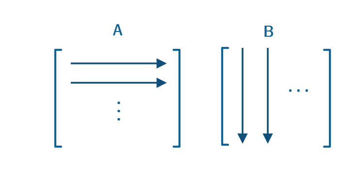
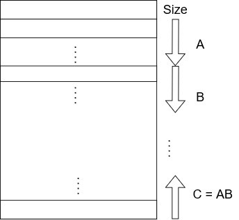
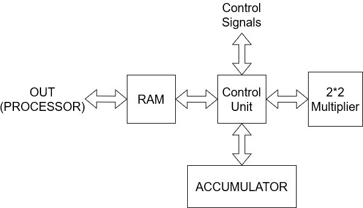
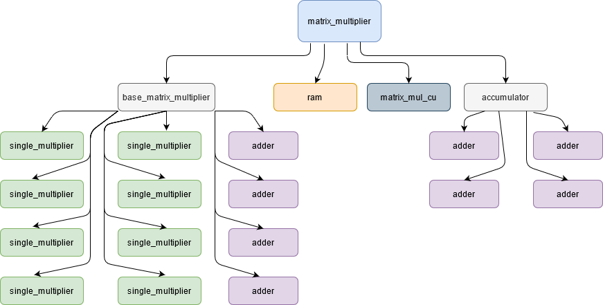
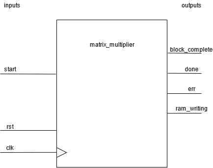
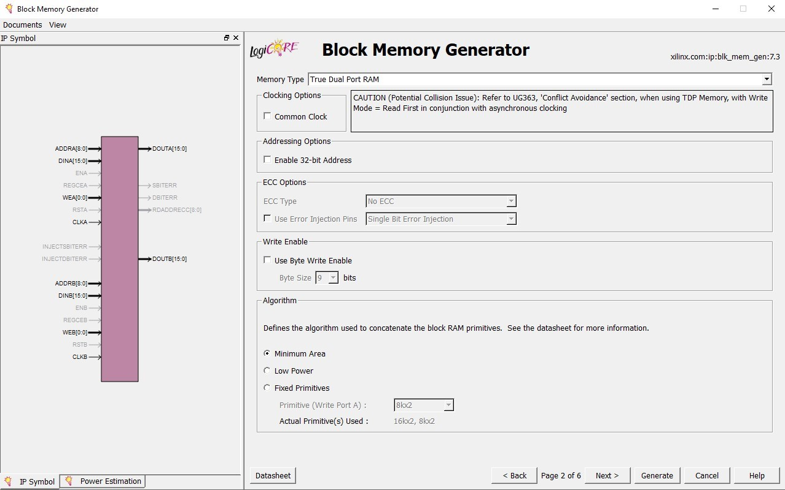
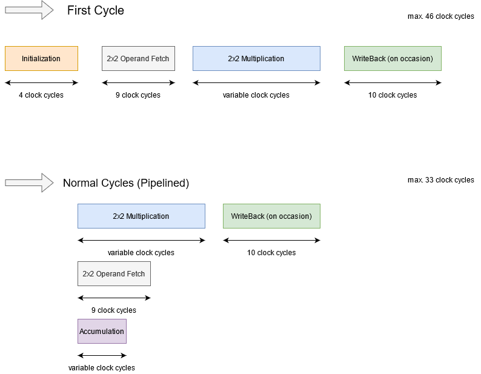
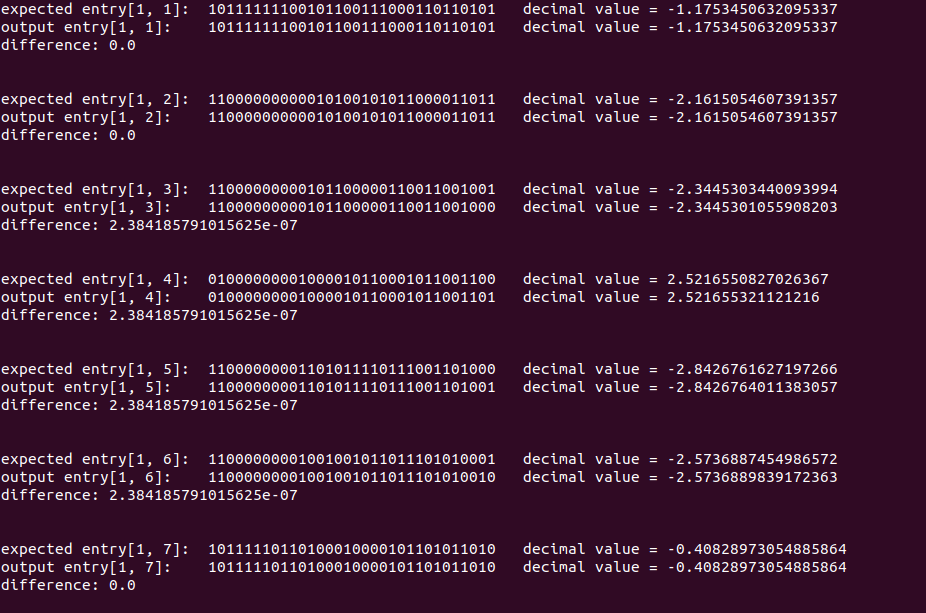
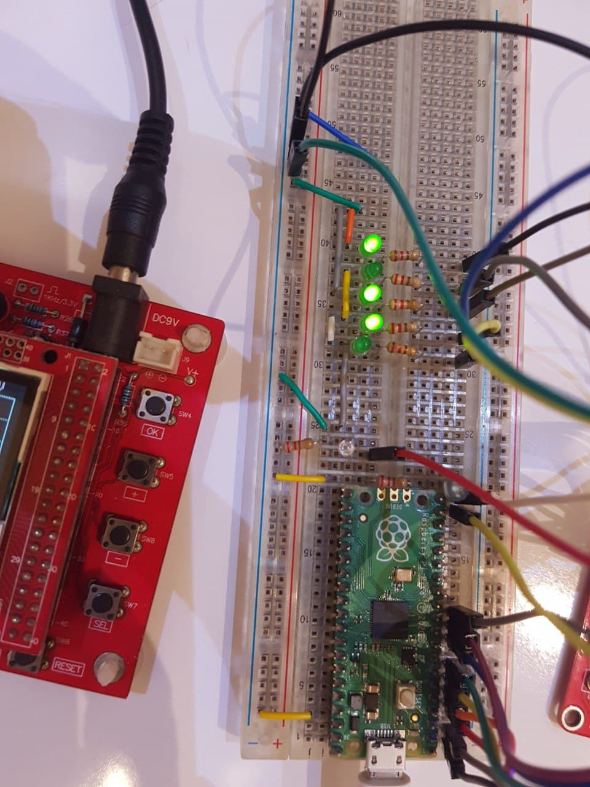
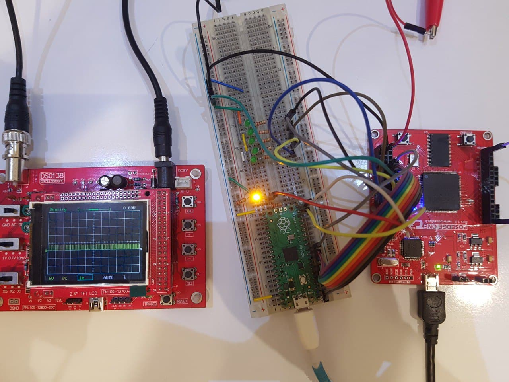

# Matrix Block Multiplier for arbitrary-sized matrices (synthesizable, Verilog)

**New:** Integer matrices have been added (currently untested)

### Brief Overview:
This system can multiply two matrices of any size (assuming they fit in our RAM and __can__ be multiplied) 
using a block-multiplication scheme.
The design is not confined by any number type - this version uses IEEE754 single-point numbers, but 
it can be easily modified to multiply any type
of numbers (static point, integer, double-precision 754, etc.)
Input matrices ('A' and 'B') are saved in some RAM, elementwise, with the following order:

The final matrices are stored in the RAM - A and B from the top (0th word, downwards) and C=AxB from 
the bottom (nth word, upwards) as such:

It breaks your matrix into 2x2 blocks, performs block multiplication and stores the results in the RAM again.

### Architecture:

The general idea is that a control unit generates read/write addresses for the RAM, manages operands and 
issues commands to an accumulator/multiplier
in order to perform the multiplication. The '2x2 multiplier' can multiply two 2x2 matrices in a few clocks. 
The accumulator can 'accumulate' a value, in
order to calculate an element from AxB as the addition of multiple products from A and B.

This is the design hierarchy, which utilizes FP multipliers and adders (as an accumulator and a 2x2 multiplier), 
a RAM unit (BRAM in our synthesis) and a control unit.

Currently, the module does not 'output' any data per se, but stores the results in its own BRAM. 
In order to write/read to this BRAM, it must be modified to a dual-port BRAM, or a MUX must be implemented to
achieve dual-port-ness in some sense.

### Pipelining:
This design is pipelined (and it can be further pipelined, for future work):

Reading the operands for the next block multiplication and the current block multiplication occur in parallel.

### Testing and Synthesis:

The included python file can test the operation of our module with the help of ModelSim. 
Also, this design has been synthesized on a Xilinx Spartan-6 FPGA, and it's operation has been verified
with the help of a Raspberry Pi Pico:

